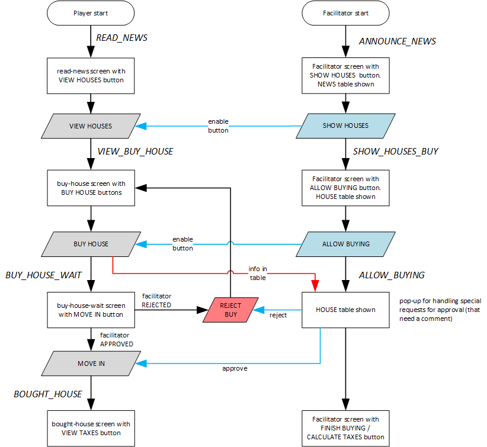

# Steps for buying a house

The interaction between facilitator and players during buying and selling a house is quite complicated, also because part of the game takes place on the game board, and players should not be allowed to enter certain information in the app before the 'manual' process has been completed. Another complication is that buying houses can only take place when all players have decided on selling or staying (and negotiated prices if they sell a house to each other). Finally, calculating taxes has to wait till all players have moved into their new house, since the taxes are dependent on the number of players who live in a community.

The steps for buying a house in round 1 (and after selling their houses in later rounds) are as follows:

#### 1. Player state: `READ_NEWS`, facilitator state: `ANNOUNCE_NEWS`
- Player is on `read-news` screen. VIEW HOUSES button is grey.
- Facilitator's SHOW HOUSES button is not clicked yet.

#### 2. Player state: `READ_NEWS`, facilitator state: `SHOW_HOUSES_BUY`
- Facilitator clicks SHOW HOUSES button.
- Player is on `read-news` screen. VIEW HOUSES button is blue.

#### 3. Player state: `VIEW_BUY_HOUSE`, facilitator state: `SHOW_HOUSES_BUY`
- The `buy-house` screen is shown. The BUY HOUSE button is grey.
- Players can check the house options, but NOT click BUY HOUSE yet.
- Players make their choices and indicate these on the board.
- Bidding takes place when needed.
- Facilitator waits till house selection is finished for all players.
- Facilitator's ALLOW BUYING button is not clicked yet.

#### 4. Player state: `VIEW_BUY_HOUSE`, facilitator state: `ALLOW_BUYING`
- Facilitator clicks ALLOW BUYING button.
- Player is on `buy-house` screen. BUY HOUSE button is blue.

#### 5. Player state: `BUY_HOUSE_WAIT`, facilitator state: `ALLOW_BUYING`
- Players click BUY HOUSE one-by-one.
- When a player has clicked BUY HOUSE, they move to the `buy-house-wait` screen.
- This screen has two grey buttons: MOVE IN and GO BACK.

#### 6a. REJECT buy. Player state: `VIEW_BUY_HOUSE`, facilitator state: `ALLOW_BUYING`
- Facilitator clicks REJECT or APPROVE for each buy in the house table, based on the correctness and the board.
- After REJECT, the GO BACK button on the player's screen turns blue.
- If the player clicks GO BACK, the `buy-house` screen is shown again; this time is immediately has a blue BUY HOUSE button.
  
#### 6b. ACCEPT buy. Player state: `BOUGHT_HOUSE`, facilitator state: `ALLOW_BUYING`
- Facilitator clicks REJECT or APPROVE for each buy in the house table, based on the correctness and the board.
- After APPROVE, the MOVE IN button on the player's screen turns blue.
- If the player clicks MOVE IN, they move to the `bought-house` screen.
- This screen has a grey VIEW TAXES button.
- The facilitator waits will all players have finished buying in the app.
- Facilitator's FINISH BUYING & COLLECT TAXES button is not clicked yet.

#### 7. Player state: `BOUGHT_HOUSE`, facilitator state: `SHOW_TAXES`
- Facilitator clicks FINISH BUYING & COLLECT TAXES button; taxes for all players in the group are calculated.
- Player is on `bought-house` screen. VIEW TAXES button is blue.

#### 8. Player state: `VIEW_TAXES`, facilitator state: `SHOW_TAXES`
- Player clicks on VIEW TAXES button.
- The `view-taxes` screen is shown. The VIEW IMPROVEMENTS button is grey.

