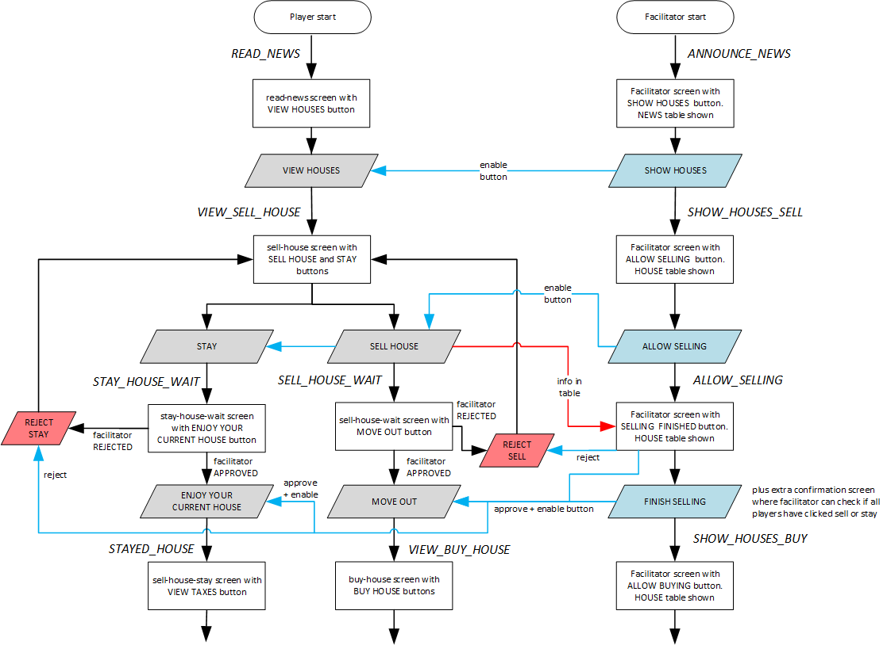

# Steps for selling a house

The interaction between facilitator and players during buying and selling a house is quite complicated, also because part of the game takes place on the game board, and players should not be allowed to enter certain information in the app before the 'manual' process has been completed. Another complication is that buying houses can only take place when all players have decided on selling or staying (and negotiated prices if they sell a house to each other).

The steps for selling a house in rounds 2 and higher are as follows:

#### 1. Player state: `READ_NEWS`, facilitator state: `ANNOUNCE_NEWS`
- Player is on `read-news` screen. VIEW HOUSES button is grey.
- Facilitator's SHOW HOUSES button is not clicked yet.

#### 2. Player state: `READ_NEWS`, facilitator state: `SHOW_HOUSES_SELL`
- Facilitator clicks SHOW HOUSES button.
- Player is on `read-news` screen. VIEW HOUSES button is blue.

#### 3. Player state: `VIEW_SELL_HOUSE`, facilitator state: `SHOW_HOUSES_SELL`
- The `sell-house` screen is shown. The SELL HOUSE and STAY buttons are grey.
- Players can check new house options (they see both the free houses and the owned houses), but they can NOT click any button yet.
- Players make their choices and indicate these on the board.
- Bidding and price negotiations take place when needed.
- Facilitator waits till house selection is finished for all players.
- Facilitator's ALLOW SELLING button is not clicked yet.

#### 4. Player state: `VIEW_SELL_HOUSE`, facilitator state: `ALLOW_SELLING`
- Facilitator clicks ALLOW SELLING button.
- Player is on `sell-house` screen. Both the SELL HOUSE and STAT buttons are blue.

### STAYING IN THE CURRENT HOUSE

#### 5.1 STAYING Player state: `STAY_HOUSE_WAIT`, facilitator state: `ALLOW_SELLING`
- Player clicks STAY.
- When a player has clicked STAY, they move to the `stay-house-wait` screen.
- This screen has two grey buttons: ENJOY CURRENT HOUSE and GO BACK.

#### 5.1a. REJECT stay. Player state: `VIEW_SELL_HOUSE`, facilitator state: `ALLOW_SELLING`
- Facilitator clicks REJECT or APPROVE for each stay in the house table, based on the correctness and the board.
- After REJECT, the GO BACK button on the player's screen turns blue.
- If the player clicks GO BACK, the `sell-house` screen is shown again; this time is immediately has blue SELL HOUSE and STAY buttons.

#### 5.1b. ACCEPT stay. Player state: `STAY_HOUSE_WAIT`, facilitator state: `ALLOW_SELLING`
- Facilitator clicks REJECT or APPROVE for each stay in the house table, based on the correctness and the board.
- After APPROVE, the ENJOY CURRENT HOUSE button stays grey till the facilitator clicks FINISH SELLING.
- The facilitator waits will all players have finished selling or staying in the app.
- Facilitator's FINISH SELLING button is not clicked yet.

#### 5.1c. ACCEPT stay. Player state: `STAYED_HOUSE`, facilitator state: `SHOW_HOUSES_BUY`
- Facilitator clicks FINISH SELLING.
- After APPROVE **and** FINISH SELLING, the ENJOY CURRENT HOUSE button on the player's screen turns blue.
- If the player clicks ENJOY CURRENT HOUSE, they move to the `stayed-house` screen.
- This screen has a grey VIEW TAXES button.
- Facilitator's ALLOW BUYING button is not clicked yet.

### SELLING THE CURRENT HOUSE

#### 5.2 SELLING Player state: `SELL_HOUSE_WAIT`, facilitator state: `ALLOW_SELLING`
- Player clicks SELL HOUSE.
- When a player has clicked SELL HOUSE, they move to the `sell-house-wait` screen.
- This screen has two grey buttons: MOVE OUT and GO BACK.

#### 5.2a. REJECT sell. Player state: `VIEW_SELL_HOUSE`, facilitator state: `ALLOW_SELLING`
- Facilitator clicks REJECT or APPROVE for each sell in the house table, based on the correctness and the board.
- After REJECT, the GO BACK button on the player's screen turns blue.
- If the player clicks GO BACK, the `sell-house` screen is shown again; this time is immediately has blue SELL HOUSE and STAY buttons.
  
#### 5.2b. ACCEPT sell. Player state: `SELL_HOUSE_WAIT`, facilitator state: `ALLOW_SELLING`
- Facilitator clicks REJECT or APPROVE for each sell in the house table, based on the correctness and the board.
- After APPROVE, the MOVE OUT button stays grey till the facilitator clicks FINISH SELLING.
- The facilitator waits will all players have finished selling or staying in the app.
- Facilitator's FINISH SELLING button is not clicked yet.

#### 5.2c. ACCEPT sell. Player state: `SELL_HOUSE_WAIT`, facilitator state: `SHOW_HOUSES_BUY`
- Facilitator clicks FINISH SELLING.
- After APPROVE **and** FINISH SELLING, the MOVE OUT button on the player's screen turns blue.

#### 5.2d. ACCEPT sell. Player state: `VIEW_BUY_HOUSE`, facilitator state: `SHOW_HOUSES_BUY`
- If the player clicks MOVE OUT, they move to the `buy-house` screen.
- This screen has a grey BUY HOUSE button.
- Facilitator's ALLOW BUYING button is not clicked yet.

After this, the players who can buy a house after selling continue with the flow as explained in the [buy-house](buy-house.md) page.
